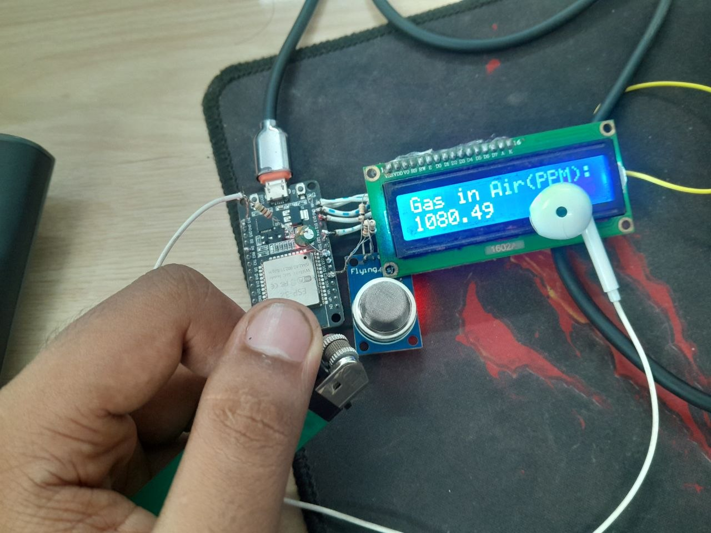

:Author: rifatparadoxical
:Email: muhammadrifat67@gmail.com
:Date: 2026-06-14
:Revision: v2
:License: MIT

= LPG Gas Leakage Detection

Small ESP32-based gas leakage detection project that reads an MQ-series gas sensor, reports PPM on a 16x2 I2C LCD and (optionally) to Arduino Cloud. The sketch includes a simple alarm sound via the ESP32 BLE when gas levels rise.

== Overview

This repository contains the Arduino sketch and supporting files used to detect LPG/gas leakage with an analog gas sensor (MQ-series). The project was developed for an ESP32 board and uses a 16x2 I2C LCD for local display.

== Features

- Reads gas sensor on analog input and computes PPM
- Displays readings and status on a 16x2 I2C LCD (0x27)
- Optional Arduino Cloud integration (via `thingProperties.h`)
- Plays alarm audio via ESP32 BLE when gas levels exceed thresholds

== Hardware Required

- ESP32 development board (or equivalent with ADC and DAC)
- MQ-series gas sensor (e.g., MQ-5 or MQ-2)
- 16x2 I2C LCD (default address 0x27)
- Wires, breadboard, 3.3V power supply

== Wiring (as used by the sketch)

- Gas sensor analog output -> GPIO35 (ADC input used in the sketch)
- I2C LCD SDA -> GPIO13, SCL -> GPIO14 (Wire.begin(13,14))
- Sensor VCC -> 3.3V (do NOT power MQ sensors from 5V when using ESP32 3.3V domain without level shifting)
- All grounds connected together

== Software Requirements

- Arduino IDE / VSCode+Arduino-CLI
- ESP32 board support installed (for Arduino IDE)
- Libraries (install via Library Manager):
  - Wire
  - LiquidCrystal_I2C
  - ArduinoIoTCloud (used if you enable cloud features)

== Quick Start

1. Install ESP32 board support in Arduino IDE.
2. Install required libraries listed above.
3. Create `arduino_secrets.h` (this file is intentionally excluded from the repository; see "Secrets and configuration" below).
4. Open `Gas_leakage_detection_jun05a.ino` in the Arduino IDE.
5. Select the correct ESP32 board and COM/USB port, then upload.
6. Open Serial Monitor at `115200` to view debug output. Wait ~60 seconds for the sensor warm-up period (the sketch shows "MQ-5 Heating Up!!").

== Secrets and configuration

The repository does NOT include `arduino_secrets.h` (it contains WiFi/cloud credentials and other sensitive information). Do not commit that file. Create it locally with your credentials. Example template (adjust to your cloud/credentials expectations):

----
// arduino_secrets.h (DO NOT COMMIT)
#ifndef ARDUINO_SECRETS_H
#define ARDUINO_SECRETS_H
#define SECRET_SSID "your-ssid"
#define SECRET_PASS "your-password"
// Add any additional secrets required by your `thingProperties.h` or cloud setup
#endif
----

== Files in this repository

- `Gas_leakage_detection_jun05a.ino` - Main Arduino sketch (ESP32)
- `thingProperties.h` - Arduino Cloud properties and bindings
- `voices.h` - PCM samples used for alarm audio
- `sketch.json` - Arduino/Project metadata
- `sketch.yaml` - Arduino/Project yaml
- `ReadMe.adoc` - This document
- `arduino_secrets.h` - NOT included (confidential)

== How it works (brief)

The sketch reads an analog value from the sensor pin, converts it to a sensor resistance (RS), computes a ratio RS/RO (RO is measured during setup after the warm-up period) and converts that ratio into an estimated PPM value using a fitted curve. When PPM crosses thresholds the sketch plays an alarm and updates `Comment`/`PPM` values (exposed to the cloud via `thingProperties.h`).
#Note: It's wise to use the previous version of wired speaker with remote access, instead of wireless and without remote connection.

== Contributing

Contributions are welcome. Open an issue or contact me at: muhammadrifat67@gmail.com

== License

This project is released under the MIT License.

== Contact

Author: rifatparadoxical
Email: muhammadrifat67@gmail.com
